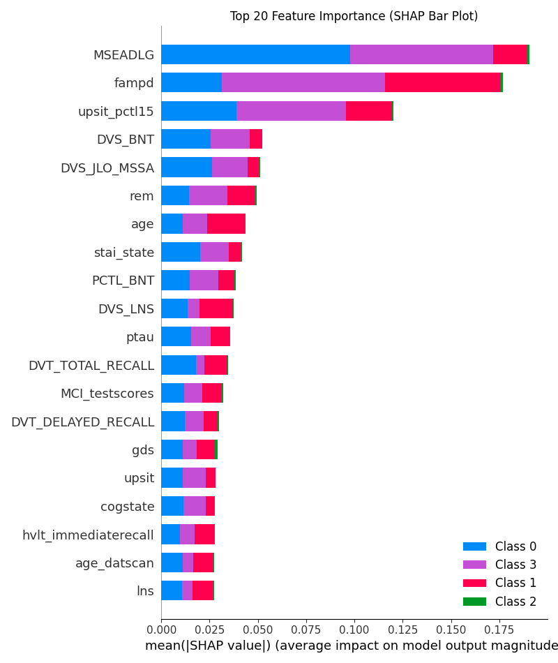
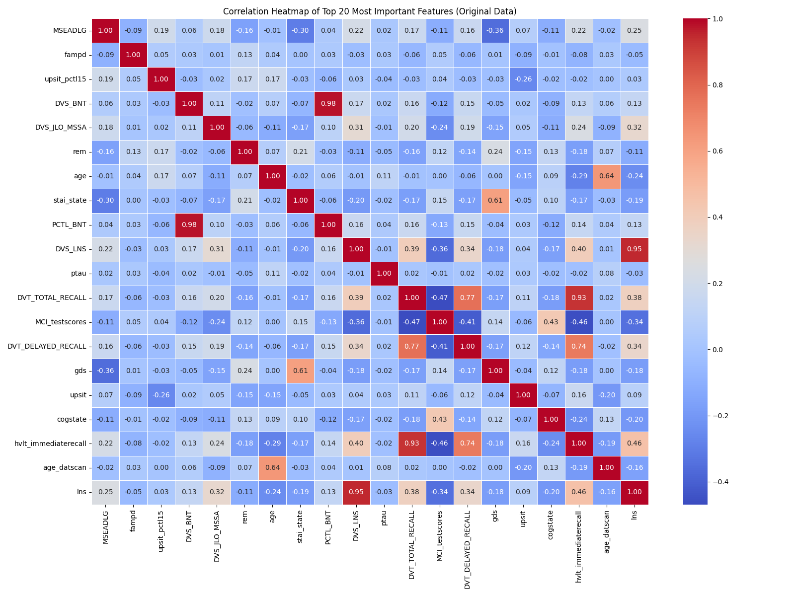

# Project Report: Parkinson's Disease Classification

## 1. Task Overview
The classification label is located in the column “COHORT”, which includes the following diagnostic groups:

- PD Participant — diagnosed Parkinson’s disease patients  
- Healthy Control — participants with no Parkinson’s symptoms  
- SWEDD — participants initially suspected of PD but showing Scans Without Evidence of Dopaminergic Deficit  
- Prodromal — individuals exhibiting early, pre-diagnostic symptoms  


Modeling Options
----------------
You may choose one of the following two modeling approaches:

1. **Random Forest Classification** with feature importance analysis.  
2. **TabTransformer-based Classification** using the implementation available at:  
   https://github.com/lucidrains/tab-transformer-pytorch


Notes and Guidelines
--------------------
- The selected feature columns are already specified in `Selected Features.docx`.  
  No additional feature selection is required.

- When splitting the data into training and validation sets, consider the **“EVENT_ID”** column:  
  - Each patient may have multiple visits.  
  - All visits from the same patient must be placed entirely in either the training or validation set.  
  - The first visit of each patient is labeled **“BL” (baseline)** in the “EVENT_ID” column.  
  - Refer to the dataset documentation for further details about “EVENT_ID”.


Evaluation Metrics
------------------
Use the following metrics to assess model performance:

- Overall accuracy  
- Per-class precision, recall, and F1-score  

If the Random Forest option is selected, also identify and rank the **top 10 most important features** contributing to the classification (e.g., motor scores, demographic variables, imaging metrics, etc.).

## 2. Implementation

This project is structured to systematically address the classification task. Below is a detailed overview of the project's architecture and workflow.

### 2.1 Project Structure
```
.
├── README.md
├── data/
│   ├── PPMI_Curated_Data_Cut_Public_20250321.xlsx
│   ├── Selected Features.docx
│   ├── Feature Value Expectations.md
│   ├── analysis_features.json
│   ├── expected_value_range.json
│   └── selected_features.json
├── notebooks/
│   └── eda.ipynb
├── processing/
│   ├── Step1_extract_features.py
│   ├── Step2_xlsx_to_csv.py
│   ├── Step3_build_df.py
│   ├── Step4_clean_pctl_bnt.py
│   ├── Step5_abnormal_processing.py
│   ├── Step6_split_dataset.py
│   └── Step7_Imputation.py
├── Random_Forest_Classification/
│   ├── train.py
│   ├── evaluate.py
│   └── feature_importance_analysis.py
└── TabTransformer-based_Classification/
    ├── train.py
    ├── evaluate.py
    ├── feature_importance_analysis.py
    └── preprocessing.py
```

### 2.2 Workflow and Component Analysis

The project's workflow is divided into three main stages: Data Preprocessing, Modeling, and Evaluation.

#### Data Sources and Feature Selection (`/data`)
The `/data` directory serves as the central repository for all datasets and feature-related documentation. While the primary datasets are in `.csv` format, several other files provide critical context and metadata:
- **`PPMI_Curated_Data_Cut_Public_20250321.xlsx`**: The original, raw dataset provided for the project in Excel format. It contains all patient visits and initial features before any processing.
- **`Selected Features.docx`**: This document lists the specific features that were pre-selected for use in the modeling process, as per the project requirements.
- **`selected_features.json` / `analysis_features.json`**: JSON formatted lists of the selected features. These files are used by the processing scripts to programmatically select the correct columns from the raw data.
- **`expected_value_range.json` / `Feature Value Expectations.md`**: These files define the expected value ranges or distributions for various features. They are crucial for the data cleaning and anomaly detection steps (`Step4` and `Step5` in processing) to identify and handle erroneous or outlier data points.

#### Data Preprocessing (`/processing`)
This directory contains a series of sequential scripts designed to clean, transform, and prepare the raw data for modeling.
- **`Step1_extract_features.py`**: Extracts the relevant features specified in `Selected Features.docx` from the raw dataset.
    - **Input**: `data/Selected Features.docx`
    - **Output**: `data/selected_features.json`, `data/Selected_Features.txt`
- **`Step2_xlsx_to_csv.py`**: Converts the data from `.xlsx` format to `.csv` for easier handling and verifies feature presence.
    - **Input**: `data/PPMI_Curated_Data_Cut_Public_20250321.xlsx`, `data/selected_features.json`
    - **Output**: `data/PPMI_Curated_Data_Cut_Public_20250321.csv`
- **`Step3_build_df.py`**: Constructs the main DataFrame by merging different data sources and selecting key features.
    - **Input**: `data/PPMI_Curated_Data_Cut_Public_20250321.csv`, `data/selected_features.json`
    - **Output**: `data/raw_data_1.0.csv`
- **`Step4_clean_pctl_bnt.py`**: Performs cleaning operations on the `PCTL_BNT` column.
    - **Input**: `data/raw_data_1.0.csv`
    - **Output**: `data/raw_data_2.0.csv`
- **`Step5_abnormal_processing.py`**: Handles outliers and abnormal values in the dataset based on cognitive test scores.
    - **Input**: `data/raw_data_2.0.csv`
    - **Output**: `data/raw_data_3.0.csv`
- **`Step6_split_dataset.py`**: Splits the data into training/validation and testing sets, ensuring that all records for a single patient belong to the same set.
    - **Input**: `data/raw_data_3.0.csv`
    - **Output**: `data/train_val_set.csv`, `data/final_test_set.csv`
- **`Step7_Imputation.py`**: Imputes missing values using a hierarchical strategy (`SmartHierarchicalImputer`) and saves the trained imputer model.
    - **Input**: `data/train_val_set.csv`, `data/final_test_set.csv`, `data/analysis_features.json`
    - **Output**: `data/imputed_train_val_set.csv`, `data/imputed_test_set.csv`, `processing/imputer.joblib`

#### Exploratory Data Analysis (`/notebooks`)
- **`eda.ipynb`**: A Jupyter Notebook dedicated to exploring the dataset, visualizing feature distributions, and identifying correlations. This step provides critical insights that inform modeling decisions.

#### Modeling and Evaluation
Two distinct modeling approaches are implemented in their respective directories.

**1. Random Forest (`/Random_Forest_Classification`)**
A traditional machine learning approach known for its robustness and interpretability.
- **`train.py`**: Loads the preprocessed data, trains the Random Forest classifier, and saves the final model to `random_forest_model.joblib`.
- **`evaluate.py`**: Loads the trained model and evaluates its performance on the test set, generating classification metrics.
- **`feature_importance_analysis.py`**: Conducts feature importance analysis using SHAP (SHapley Additive exPlanations) to identify the top predictors and generates visualization plots.

**2. TabTransformer (`/TabTransformer-based_Classification`)**
A deep learning model specifically designed for tabular data, leveraging self-attention mechanisms.
- **`preprocessing.py`**: Contains functions for preparing the data specifically for the TabTransformer model, such as categorical feature embedding.
- **`train.py`**: Defines the TabTransformer architecture, sets up the training loop using PyTorch, and saves the trained model weights to `tab_transformer_model.pt`.
- **`evaluate.py`**: Evaluates the trained TabTransformer model on the test set.
- **`feature_importance_analysis.py`**: Applies SHAP to the deep learning model to provide insights into its decision-making process.

This structured approach ensures modularity and reproducibility, allowing for easy experimentation and clear documentation of the results.

### 2.3 Final Project Structure
After running all the processing and training scripts, the project directory contains not only the source code but also all the generated data, models, and results. The following tree shows the complete structure with all key artifacts.

```
.
├── README.md
├── data/
│   ├── PPMI_Curated_Data_Cut_Public_20250321.xlsx
│   ├── Selected Features.docx 
│   ├── ... (other source data files)
│   ├── raw_data_1.0.csv
│   ├── raw_data_2.0.csv
│   ├── raw_data_3.0.csv
│   ├── train_val_set.csv
│   ├── final_test_set.csv
│   ├── imputed_train_val_set.csv
│   └── imputed_test_set.csv
├── notebooks/
│   └── eda.ipynb
├── processing/
│   ├── Step1_extract_features.py
│   ├── ... (all 7 processing scripts)
│   └── imputer.joblib
├── Random_Forest_Classification/
│   ├── train.py
│   ├── evaluate.py
│   ├── feature_importance_analysis.py
│   ├── random_forest_model.joblib
│   ├── evaluation_metrics.png
│   ├── shap_summary_bar_plot.png
│   └── top_20_features_correlation_heatmap.png
└── TabTransformer-based_Classification/
    ├── train.py
    ├── evaluate.py
    ├── feature_importance_analysis.py
    ├── preprocessing.py
    ├── tab_transformer_model.pt
    ├── evaluation_metrics.png
    ├── shap_summary_bar_plot.png
    └── top_20_features_correlation_heatmap.png

```

## 3. Result
The performance of each model was evaluated on the test set. Below is a summary of the results.

### 3.1 Random Forest Classification
The Random Forest model achieved strong performance in distinguishing between the different patient cohorts.

- **Evaluation Metrics**:
  *A summary of performance including overall accuracy, and per-class precision, recall, and F1-score.*
  
  

- **Feature Importance**:
  *SHAP analysis was used to determine the top features influencing the model's predictions. The following plot highlights the most significant features.*

  

- **Feature Correlation**:
  *A heatmap showing the correlation between the top 20 most important features.*

  


### 3.2 TabTransformer-based Classification
The TabTransformer model, a deep learning approach, provided competitive results by capturing complex patterns in the tabular data.

- **Evaluation Metrics**:
  *Performance metrics for the TabTransformer model.*
  
  

- **Feature Importance**:
  *Although deep learning models are often less interpretable, SHAP analysis provides insights into feature contributions.*

  

- **Feature Correlation**:
  *A heatmap illustrating the correlations among the top 20 features as identified by the model.*

  
